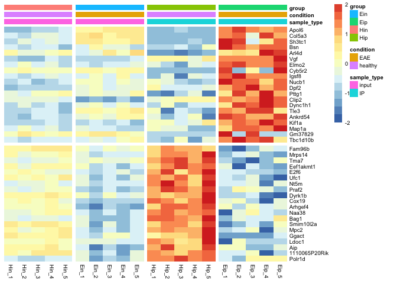

<!-- README.md is generated from README.Rmd. Please edit that file -->

# tidyheatmap

<!-- badges: start -->

[](https://travis-ci.org/jbengler/tidyheatmap)
[](https://www.tidyverse.org/lifecycle/#experimental)
[](https://codecov.io/gh/jbengler/tidyheatmap?branch=master)
<!-- badges: end -->

The goal of `tidyheatmap` is to provide a tidyverse-style interface to
the powerful heatmap package
[pheatmap](https://github.com/raivokolde/pheatmap) by
[@raivokolde](https://github.com/raivokolde). This enables the
convenient generation of complex heatmaps from tidy data.

## Installation

You can install `tidyheatmap` from GitHub with:

``` r
# install.packages("devtools")

devtools::install_github("jbengler/tidyheatmap")
```

## Example

Given a tidy data frame of gene expression data like `data_exprs`, you
can easily generate a customized heatmap.

``` r
library(tidyheatmap)

tidy_heatmap(data_exprs,
             rows = external_gene_name,
             columns = sample,
             values = expression,
             annotation_col = c(sample_type, condition, group),
             scale = "row",
             color_scale_n = 16,
             color_scale_min = -2,
             color_scale_max = 2,
             gaps_row = direction,
             gaps_col = group
)
#> $m
#>                   Hin_1     Hin_2     Hin_3     Hin_4     Hin_5     Ein_1
#> Apol6          2.203755  2.203755  2.660558  2.649534  3.442740  5.030997
#> Col5a3         3.623289  2.950514  3.883794  3.821838  3.486696  5.347029
#> Sh3tc1         3.094325  3.945669  3.721781  4.071979  3.569361  5.758298
#> Bsn            9.594692  9.481155  9.663027  9.621492  9.254889  9.549501
#> Arl4d          6.379306  5.795141  5.767258  5.991696  6.256381  5.513601
#> Vgf            7.386505  6.861794  7.266003  7.738055  7.575901  7.385140
#> Elmo2          8.964594  9.191505  8.996498  9.091161  8.877599  8.940428
#> Cyb5r2         3.846136  4.181117  3.778346  3.687823  3.817430  4.242324
#> Igsf8          8.357730  8.182801  8.386692  8.557224  8.453666  8.401367
#> Nucb1          8.472584  8.486825  8.245469  8.378464  8.521781  8.934631
#> Dpf2           8.209568  8.291422  8.374594  8.442385  8.289120  8.723934
#> Pttg1          8.137118  7.937426  8.404651  8.352276  8.469586  8.156889
#> Clip2          8.754678  8.733512  8.694684  8.715489  8.554136  7.846969
#> Dync1h1       11.602393 11.942333 11.551018 11.851763 11.346086 12.000915
#> Tle3           7.289507  7.292232  7.546951  7.607970  7.198383  8.416004
#> Ankrd54        5.867274  5.619651  6.048261  5.986635  5.665235  6.463674
#> Kif1a         12.437160 12.581432 12.410019 12.770907 12.579293 12.524093
#> Map1a         13.417764 13.772932 13.446422 13.530706 13.201875 13.563318
#> Gm37829        3.911792  4.704230  4.474480  3.796259  4.124560  4.462020
#> Tbc1d10b       8.827458  8.456042  8.726761  8.808308  8.656032  8.639146
#> Fam96b         7.835157  7.517774  7.957167  8.045903  8.081315  7.301972
#> Mrps14         9.088216  8.681238  8.922262  8.876584  9.258166  8.500837
#> Tma7           6.811239  6.566974  6.949656  6.908019  7.116900  6.844333
#> Eef1akmt1      7.099069  6.641980  7.059650  7.361731  7.093585  6.844333
#> E2f6           8.896741  9.150440  8.964573  8.654886  8.829067  8.465089
#> Ufc1           9.416171  9.296585  9.387115  9.321553  9.659070  8.983176
#> Nt5m           7.804291  7.995676  8.048851  8.187596  7.817257  7.979595
#> Praf2          8.381444  8.195282  8.537184  8.777298  8.709678  7.945404
#> Dyrk1b         6.547531  6.467346  6.543533  6.825701  6.429647  6.044776
#> Cox19          7.678025  7.837444  7.647610  7.914175  7.539717  7.035425
#> Arhgef4       10.341459 10.299102 10.306279 10.569326 10.301059  9.643109
#> Naa38          6.916126  6.660135  7.287685  7.481177  7.418356  6.397601
#> Bag1          10.574157 10.398226 10.500136 10.594572 10.454331 10.484227
#> Smim10l2a      7.894974  7.404043  7.899221  7.873827  7.571691  6.825633
#> Mpc2           9.548895  9.108171  9.299191  9.511867  9.882313  8.854007
#> Ggact          6.739533  6.404070  6.492079  6.258252  6.592570  5.137649
#> Ldoc1          5.691651  5.692469  5.816111  6.162898  5.531716  5.095964
#> Aip           10.641707 10.466733 10.643964 10.766897 10.318114  9.478571
#> 1110065P20Rik  5.302977  5.024172  5.703733  5.750027  5.616628  4.939347
#> Polr1d         8.553674  8.320197  8.445705  8.649320  8.645059  8.669130
#>                   Ein_2     Ein_3     Ein_4     Ein_5     Hip_1     Hip_2
#> Apol6          5.314412  5.372403  5.536960  5.645714  2.203755  2.203755
#> Col5a3         5.970917  5.200783  5.380863  5.414576  2.203755  2.203755
#> Sh3tc1         5.628464  4.943715  5.004403  5.505737  2.203755  2.203755
#> Bsn           10.336688  9.978072  9.823801  9.465946  9.427566  9.401769
#> Arl4d          5.697178  6.555629  6.031178  7.073764  4.493476  4.561038
#> Vgf            7.394351  7.393358  7.676219  7.781865  9.049624  9.300449
#> Elmo2          8.777253  8.986457  8.935158  9.130373  9.052209  8.822092
#> Cyb5r2         4.330928  3.906655  4.122089  4.180508  2.203755  2.203755
#> Igsf8          8.692153  8.365600  8.955830  8.445110  8.056258  8.517292
#> Nucb1          9.042499  8.533012  8.976209  8.717655  9.020879  8.859275
#> Dpf2           8.901595  8.525343  8.685763  8.714508  9.131351  8.539024
#> Pttg1          8.262570  8.153131  8.188274  8.504625  7.394518  7.203414
#> Clip2          8.004669  7.980647  8.256524  7.994040  8.739036  8.891307
#> Dync1h1       12.203191 11.700997 12.095691 11.835714 11.587370 12.117493
#> Tle3           8.538112  8.166341  8.529046  8.603207  8.275674  6.664542
#> Ankrd54        6.806487  6.350472  7.038793  6.907131  6.425222  5.510484
#> Kif1a         12.726740 12.468208 12.601176 12.239755 13.040172 13.008885
#> Map1a         13.414518 13.374582 13.211265 13.125640 13.819813 13.550660
#> Gm37829        4.909113  4.627398  4.316214  3.711095  2.203755  2.203755
#> Tbc1d10b       8.861327  8.849873  9.273811  9.404788  8.528672  8.086715
#> Fam96b         6.356636  7.066705  6.689155  7.317450  8.756578  9.641596
#> Mrps14         7.942847  8.427253  8.188274  8.342835  9.832043 10.285114
#> Tma7           7.254255  7.016478  6.784851  7.150363  8.193745  8.906015
#> Eef1akmt1      5.794391  6.338816  5.536960  6.228244  8.030265  8.767910
#> E2f6           8.290413  8.496872  8.685763  8.219487  9.891710 10.713109
#> Ufc1           8.333873  8.823020  8.300294  9.017444 10.487858 10.344933
#> Nt5m           7.665054  7.938917  7.891876  7.775837  9.325486 10.060336
#> Praf2          7.549944  8.088675  7.608173  8.004387  9.811593 10.681098
#> Dyrk1b         5.269735  6.254461  5.536960  5.797272  7.627413  7.060328
#> Cox19          6.759376  7.038219  7.089617  7.033880  8.961613  8.730623
#> Arhgef4        9.170855  9.791434  9.706727  9.408687 10.840547 11.551055
#> Naa38          5.556250  6.373502  5.536960  6.210416  9.131351  9.457031
#> Bag1           9.941392 10.009557  9.893316 10.284755 11.955751 12.001475
#> Smim10l2a      5.357711  6.662247  5.608986  6.363402  8.146133  8.967404
#> Mpc2           8.011377  8.600253  8.140910  8.714508 10.555920 10.918746
#> Ggact          4.966731  5.839785  6.082447  5.382831  6.480152  7.029922
#> Ldoc1          5.075229  5.147621  4.891888  4.792294  7.698471  7.090106
#> Aip            8.360385  9.399647  8.734433  9.125643 11.376675 12.298776
#> 1110065P20Rik  3.904594  4.587228  3.606475  4.742274  6.839297  6.254633
#> Polr1d         8.024701  8.301193  8.211385  8.803094  9.974441 10.069697
#>                   Hip_3     Hip_4     Hip_5     Eip_1     Eip_2     Eip_3
#> Apol6          2.619196  2.203755  2.203755  7.207838  8.418188  7.505587
#> Col5a3         2.203755  2.203755  2.203755  6.900971  7.825300  3.719267
#> Sh3tc1         2.203755  2.932447  2.203755  8.434457  8.051111  3.719267
#> Bsn            9.520877  9.264847 10.194225 11.871814 11.444950 11.083346
#> Arl4d          4.205448  4.438281  4.835291  6.552481  7.099169  6.695912
#> Vgf            9.204563  8.585649  9.514597 10.931662 11.184191 11.176536
#> Elmo2          8.525198  9.101038  8.908268  9.970747 10.031208  9.857982
#> Cyb5r2         2.203755  2.203755  2.203755  6.728107  2.203755  4.266641
#> Igsf8          7.506240  8.486750  8.279999  9.808985 10.289182  9.777884
#> Nucb1          8.391101  8.083832  8.309137 10.775210 10.149783 10.243176
#> Dpf2           8.502422  8.623033  8.841703  9.802469 10.066092 10.665406
#> Pttg1          7.689547  8.076149  7.097184  8.709842  9.649422  9.101513
#> Clip2          9.086007  9.180797  9.213187  9.966868  9.802079  9.933866
#> Dync1h1       11.481329 11.809939 11.841209 12.494681 13.397535 13.314656
#> Tle3           7.493971  7.238095  6.794339  9.548462  9.224495  9.958299
#> Ankrd54        5.953090  6.674710  4.889054  8.830037  8.418188  7.749207
#> Kif1a         12.765709 12.826279 13.523318 13.965006 14.222354 14.103765
#> Map1a         13.495391 12.977465 12.929212 14.300342 14.931126 14.920673
#> Gm37829        2.203755  2.203755  2.203755  9.246378  2.203755  7.156942
#> Tbc1d10b       9.274336  7.894408  9.084301 10.594685 11.215603 10.784057
#> Fam96b         9.161602  9.031911  8.667046  5.036369  2.203755  5.396467
#> Mrps14        10.446139 10.017238 11.681903  7.627301  8.184126  8.491745
#> Tma7           9.061288  8.231774  9.120360  6.303794  5.908813  5.188813
#> Eef1akmt1      9.211133  8.529567  9.025541  6.593407  4.392886  6.345960
#> E2f6           9.538148 10.242673 11.423428  8.411804  8.471214  8.139536
#> Ufc1          10.697065 10.061670 10.952405  8.825760  8.418188  8.995318
#> Nt5m           9.326266  8.935445  9.889655  7.749807  7.741421  8.020793
#> Praf2         10.220552  9.916178 10.587568  7.854334  8.953492  8.737433
#> Dyrk1b         7.726716  7.583559  8.789252  5.259213  5.096047  5.396467
#> Cox19          8.382811  8.730516  9.530145  7.438400  7.557424  6.911790
#> Arhgef4       11.459819 11.299810 11.583997 10.404160  9.822626 10.452586
#> Naa38          8.684764  8.869578  9.539394  4.530752  6.623996  7.505587
#> Bag1          11.721443 11.641706 12.408304  9.989989 10.520580 10.411887
#> Smim10l2a      8.992131  8.145087  9.397410  5.152236  5.908813  6.345960
#> Mpc2          10.697065 10.431086 11.836423  8.511054  8.665741  9.427408
#> Ggact          7.197444  7.499866  9.511467  4.342894  4.392886  4.266641
#> Ldoc1          6.651752  6.691598  9.855504  2.203755  5.560057  4.266641
#> Aip           11.120444 11.242921 12.433740 10.157616 10.213406  8.914373
#> 1110065P20Rik  6.208129  6.760435  7.016961  4.342894  4.392886  5.188813
#> Polr1d        10.414774  9.896324 10.241586  8.667443  8.119152  9.158861
#>                   Eip_4     Eip_5
#> Apol6          7.116522  7.692020
#> Col5a3         8.444539  6.795068
#> Sh3tc1         5.605475  7.439714
#> Bsn           11.585093 11.489941
#> Arl4d          8.637639  8.449852
#> Vgf           10.864963 12.160344
#> Elmo2          9.872046 10.027214
#> Cyb5r2         2.203755  8.632506
#> Igsf8          9.726716  9.615808
#> Nucb1          9.657107 10.140765
#> Dpf2           9.674827 10.185692
#> Pttg1          9.793121  9.031047
#> Clip2         10.594067 10.339874
#> Dync1h1       13.595866 13.354095
#> Tle3          10.125012  8.835462
#> Ankrd54        7.836834  8.773737
#> Kif1a         14.682213 14.385192
#> Map1a         14.732255 15.269623
#> Gm37829        2.203755  2.203755
#> Tbc1d10b      11.092944  9.728544
#> Fam96b         6.765439  6.373782
#> Mrps14         7.705013  7.481524
#> Tma7           6.103697  7.052702
#> Eef1akmt1      5.605475  5.145525
#> E2f6           8.268975  7.898976
#> Ufc1           8.014395  7.418346
#> Nt5m           7.008741  8.073099
#> Praf2          8.359427  7.718482
#> Dyrk1b         4.170949  3.253924
#> Cox19          6.103697  7.385686
#> Arhgef4       10.072506 10.171403
#> Naa38          6.299870  5.807935
#> Bag1          10.317786 11.193410
#> Smim10l2a      5.270378  6.996101
#> Mpc2           7.116522  9.034560
#> Ggact          4.170949  5.197424
#> Ldoc1          4.170949  4.389168
#> Aip            9.044393  9.930596
#> 1110065P20Rik  2.203755  4.190115
#> Polr1d         9.149524  9.089636
#> 
#> $annotation_row
#> [1] NA
#> 
#> $annotation_col
#>       sample_type condition group
#> Hin_1       input   healthy   Hin
#> Hin_2       input   healthy   Hin
#> Hin_3       input   healthy   Hin
#> Hin_4       input   healthy   Hin
#> Hin_5       input   healthy   Hin
#> Ein_1       input       EAE   Ein
#> Ein_2       input       EAE   Ein
#> Ein_3       input       EAE   Ein
#> Ein_4       input       EAE   Ein
#> Ein_5       input       EAE   Ein
#> Hip_1          IP   healthy   Hip
#> Hip_2          IP   healthy   Hip
#> Hip_3          IP   healthy   Hip
#> Hip_4          IP   healthy   Hip
#> Hip_5          IP   healthy   Hip
#> Eip_1          IP       EAE   Eip
#> Eip_2          IP       EAE   Eip
#> Eip_3          IP       EAE   Eip
#> Eip_4          IP       EAE   Eip
#> Eip_5          IP       EAE   Eip
#> 
#> $gaps_row
#> [1] 20
#> 
#> $gaps_col
#> [1]  5 10 15
```



## Documentation

<https://jbengler.github.io/tidyheatmap/>
